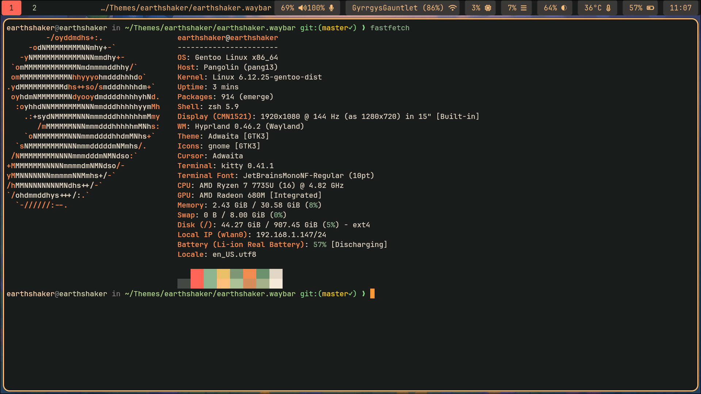

# 🌍 Earthshaker Waybar Theme

A dark, earthy, and vivid Waybar theme designed to pair seamlessly with the [Earthshaker Sway Theme](https://github.com/remusearthshaker/earthshaker.sway). This theme brings a grounded aesthetic to your status bar while remaining legible and modular across tiling window manager setups.



## ✨ Features

- Deep, rich forest tones with vibrant highlights  
- Earthshaker color palette integration  
- Bold styling for key modules  
- Fully modular JSON config structure  
- Clean font and spacing for minimal distraction  
- Nerd Font compatible

## 📦 Installation

Clone the repository:

```bash
git clone https://github.com/remusearthshaker/earthshaker.waybar ~/.config/waybar
```

Or copy specific files into your existing config:

```bash
cp style.css ~/.config/waybar/
cp config.jsonc ~/.config/waybar/
```

Don't forget to install a Nerd Font (e.g., JetBrainsMono Nerd Font) for proper glyph rendering.

## 🎨 Recommended Setup

For best results, pair with:

- [Earthshaker Sway](https://github.com/remusearthshaker/earthshaker.sway) for your window manager
- JetBrainsMono Nerd Font or equivalent
- Background image or wallpaper with earthy greens, browns, and subtle highlights
- A terminal emulator styled with [Earthshaker WezTerm](https://github.com/remusearthshaker/earthshaker.wezterm) or [Earthshaker Kitty](https://github.com/remusearthshaker/earthshaker.kitty)

## 🛠 Configuration

Modify `config.jsonc` and `style.css` to match your desired layout and modules.

Modules typically include:

- `cpu`
- `memory`
- `battery`
- `clock`
- `pulseaudio`
- `network`
- `custom` scripts

Feel free to customize further and make it your own.

## 💡 Contributing

Pull requests and issues welcome. Help us make this theme even better.

## 📜 License

This project is licensed under the MIT License. See [`LICENSE.md`](./LICENSE.md) for details.
